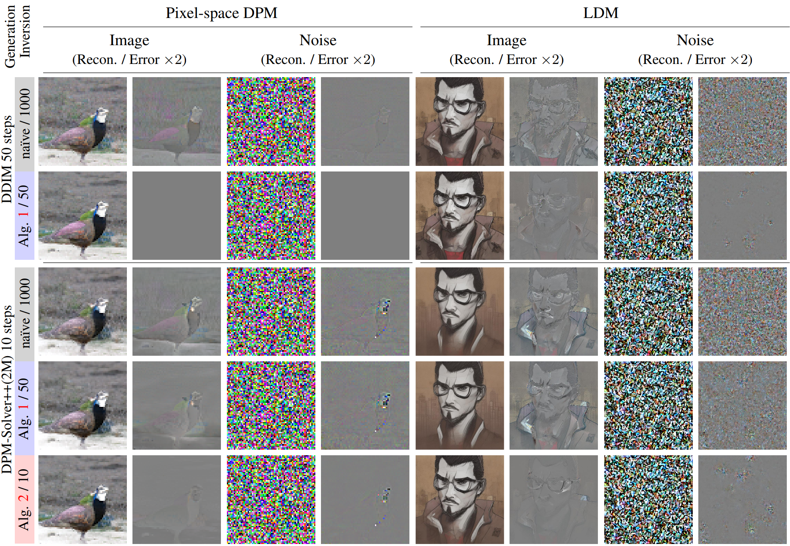

---
# Feel free to add content and custom Front Matter to this file.
# To modify the layout, see https://jekyllrb.com/docs/themes/#overriding-theme-defaults

layout: default
permalink: /inv-dpm.html

---

## 
  On Exact Inversion of DPM-Solvers

#### 
 <a href="">Seongmin Hong</a>1, <a href="https://www.linkedin.com/in/khlee0192">Kyeonghyun Lee</a>1, <a href="https://www.linkedin.com/in/suhyoonjeon">Suh Yoon Jeon</a>1, <a href="https://www.linkedin.com/in/hyewon-bae-05865a260">Hyewon Bae</a>1, <a href="https://icl.snu.ac.kr/pi">Se Young Chun</a>1,2

1Dept. of Electrical and Computer Engineering,   
 
2INMC, Interdisciplinary Program in AI   
 
Seoul National University, Republic of Korea

### 
 <strong>CVPR 2024</strong> 

#### 
[<a href="https://openaccess.thecvf.com/content/CVPR2024/papers/Hong_On_Exact_Inversion_of_DPM-Solvers_CVPR_2024_paper.pdf">Paper</a>] [<a href="https://openaccess.thecvf.com/content/CVPR2024/supplemental/Hong_On_Exact_Inversion_CVPR_2024_supplemental.pdf">supp</a>] [<a href="http://arxiv.org/abs/2311.18387">arXiv</a>] [<a href="https://github.com/smhongok/inv-dpm">github</a>] [<a href="#bibtex">bibTeX</a>]

     

  

#### We propose the exact inversion methods to find the initial noise of the images generated by various diffusion probabilistic models (DPMs).

     

|                             | Standard  sampling  methods              | Inversion of  high-order  DPM-solvers         | Inversion with   classifier-free  guidance > 1 |
| --------------------------- | ----------------------------------------------------- | ----------------------------------------------------- | ----------------------------------------------------- |
| Wallace et al. | ✗ | ✗ | ✔ |
| Zhang et al. | ✗ | ✗ | ✔ |
| Pan et al.    | ✔ | ✗ | ✗ |
| *Ours*                      | ✔ | ✔ | ✔ |

#### 
 We can perform exact inversion w/o model modification regardless of whether the images were generated using high-order DPM-solvers or large classifier-free guidance. 

     

  

#### 
 We use the backward Euler method for exact inversion. For inversion of high-order DPM-solvers, we approximate high-order terms. 

     

  

#### 
 Our Algorithms (rows 2, 5) significantly reduce reconstruction errors, whether it’s for images or noise, DDIM or high-order DPM-solvers, or pixel-space DPM or Stable Diffusion. 

     

  

#### 
 Our exact inversion improves the watermark detection of Wen et al., 

     

  

#### 
 improves the background-preserving image editing of Patashnik et al. 

    

### Abstract

Diffusion probabilistic models (DPMs) are a key component in modern generative models. DPM-solvers have achieved reduced latency and enhanced quality significantly, but have posed challenges to find the exact inverse (i.e., finding the initial noise from the given image). Here we investigate the exact inversions for DPM-solvers and propose algorithms to perform them when samples are generated by the first-order as well as higher-order DPM-solvers. For each explicit denoising step in DPM-solvers, we formulated the inversions using implicit methods such as gradient descent or forward step method to ensure the robustness to large classifier-free guidance unlike the prior approach using fixed-point iteration. Experimental results demonstrated that our proposed exact inversion methods significantly reduced the error of both image and noise reconstructions, greatly enhanced the ability to distinguish invisible watermarks and well prevented unintended background changes consistently during image editing.

  

### References

- Bram Wallace, Akash Gokul, and Nikhil Naik. EDICT: Exact Diffusion Inversion via Coupled Transformations. In CVPR, pages 22532–22541, 2023.
- Guoqiang Zhang, Jonathan P Lewis, and W Bastiaan Kleijn. Exact diffusion inversion via bi-directional integration approximation. arXiv:2307.10829, 2023.
- Zhihong Pan, Riccardo Gherardi, Xiufeng Xie, and Stephen Huang. Effective real image editing with accelerated iterative diffusion inversion. In ICCV, pages 15912–15921, 2023.
- Yuxin Wen, John Kirchenbauer, Jonas Geiping, and Tom Goldstein. Tree-Ring Watermarks: Fingerprints for diffusion images that are invisible and robust. arXiv:2305.20030, 2023.
- Or Patashnik, Daniel Garibi, Idan Azuri, Hadar Averbuch-Elor, and Daniel Cohen-Or. Localizing object-level shape variations with text-to-image diffusion models. In ICCV, 2023.

  

<a name="bibtex">

### BibTeX

<pre> 
@InProceedings{Hong_2024_CVPR,
    author    = {Hong, Seongmin and Lee, Kyeonghyun and Jeon, Suh Yoon and Bae, Hyewon and Chun, Se Young},
    title     = {On Exact Inversion of DPM-Solvers},
    booktitle = {Proceedings of the IEEE/CVF Conference on Computer Vision and Pattern Recognition (CVPR)},
    month     = {June},
    year      = {2024},
    pages     = {7069-7078}
}
</pre>
