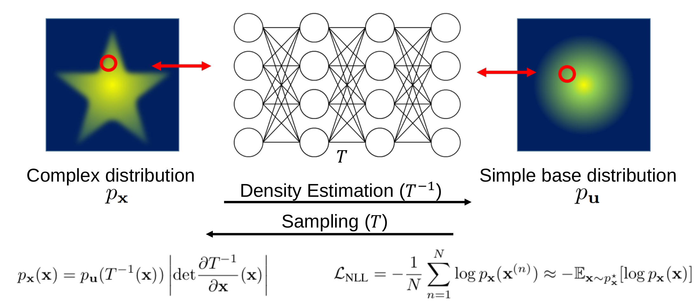
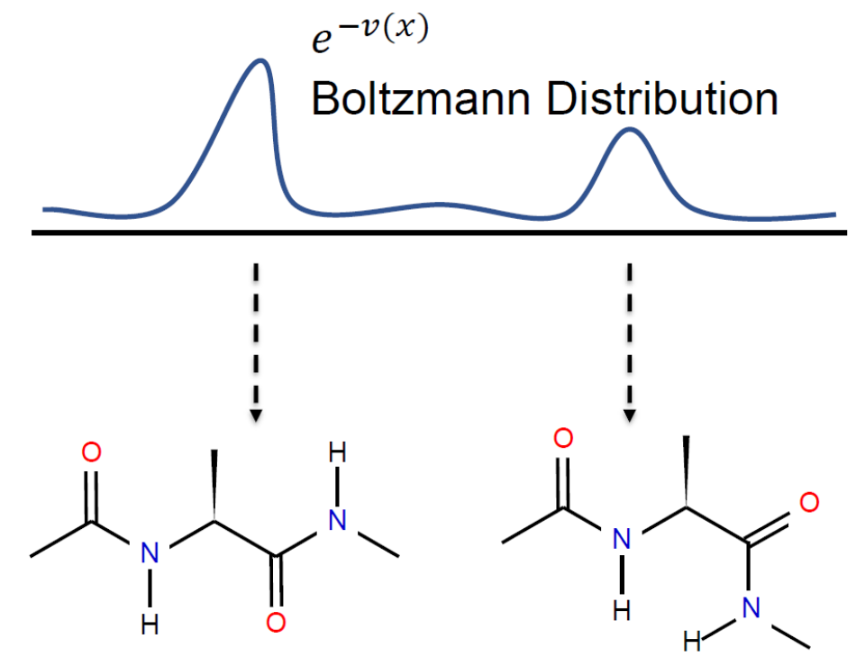
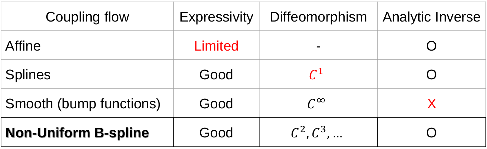
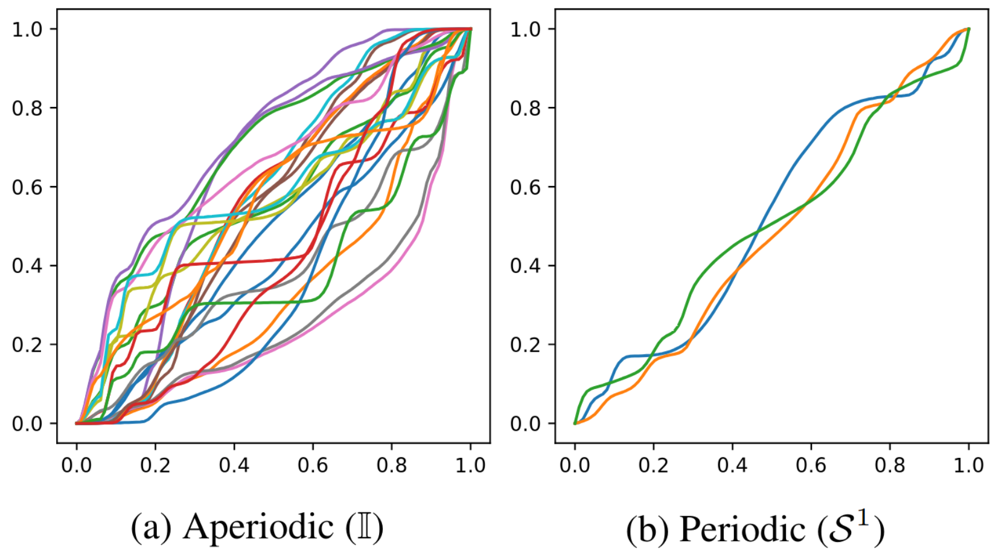
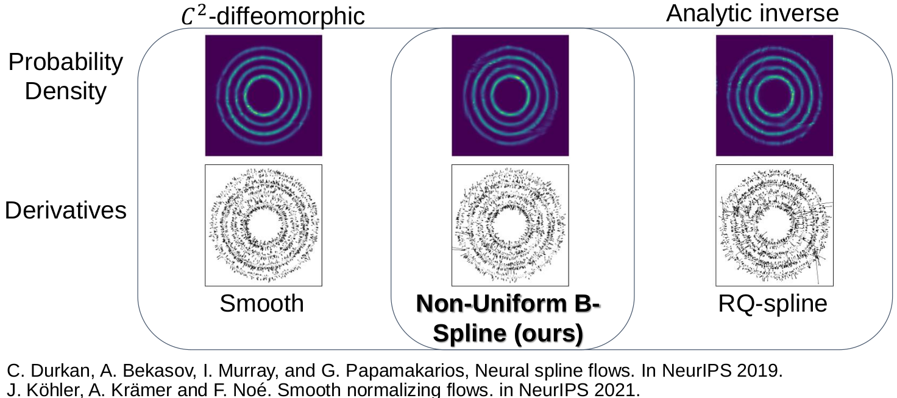
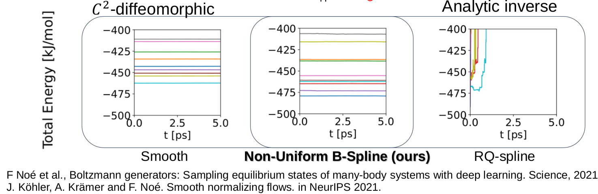
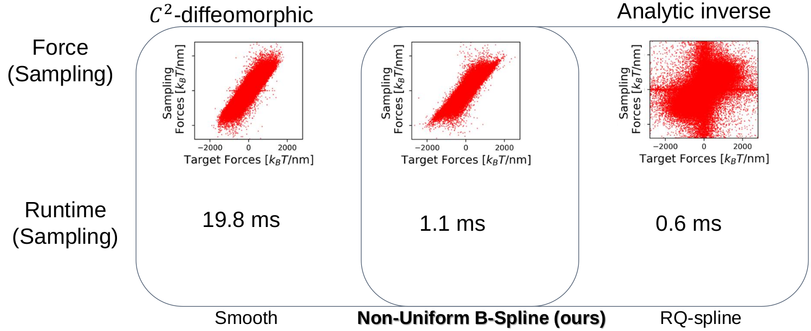

---
# Feel free to add content and custom Front Matter to this file.
# To modify the layout, see https://jekyllrb.com/docs/themes/#overriding-theme-defaults

layout: default
permalink: /nubsf.html
---
## 
  Neural Diffeomorphic Non-uniform B-spline Flows 

#### 
 <a href="">Seongmin Hong</a>1 , <a href="https://icl.snu.ac.kr/pi">Se Young Chun</a>1,2

1Dept. of Electrical and Computer Engineering,   
 
2INMC, Interdisciplinary Program in AI   
 
Seoul National University, Republic of Korea

 
### 
 <strong>AAAI 2023</strong> 

#### 
 [<a href="https://arxiv.org/abs/2304.04555">arXiv</a>] [<a href="https://github.com/smhongok/Non-uniform-B-spline-Flow">github</a>] [<a href="/bibtex.html#hong23neural">bibTeX</a>]

     

  

#### 
 Normalizing flows have been successfully modeling a complex probability distribution as an invertible transformation of a simple base distribution. 

     

  

#### 
 However, there are often applications that require more than invertibility, such as Boltzmann Generator: The computation of energies and forces in physics requires the second derivatives of the transformation to be well-defined and continuous. 

     

  

#### 
Existing normalizing flows have their own weaknesses, so here comes our motivation. Our Non-Uniform B-spline flow has sufficient expressivity, at least C2-diffeomorphic, and has an analytic inverse. 

     

  

#### 
We can observe that the non-uniform B-spline we have created is diffeomorphic, invertible, and sufficiently expressive.

     

  

#### 
 To validate our findings, we conducted experiments on a toy dataset, 

 

  

#### 
 molecule dynamic simulation, (As stable as smooth normalizing flows!) 

 

  

#### 
 and molecule structure generation. (Faster than smooth normalizing flows!) 

     

### Abstract
Normalizing flows have been successfully modeling a complex probability distribution as an invertible transformation of a simple base distribution. However, there are often applications that require more than invertibility. For instance, the computation of energies and forces in physics requires the second derivatives of the transformation to be well-defined and continuous. Smooth normalizing flows employ infinitely differentiable transformation, but with the price of slow non-analytic inverse transforms. In this work, we propose diffeomorphic non-uniform B-spline flows that are at least twice continuously differentiable while bi-Lipschitz continuous, enabling efficient parametrization while retaining analytic inverse transforms based on a sufficient condition for diffeomorphism. Firstly, we investigate the sufficient condition for Ck-2-diffeomorphic non-uniform kth-order B-spline transformations. Then, we derive an analytic inverse transformation of the non-uniform cubic B-spline transformation for neural diffeomorphic non-uniform B-spline flows. Lastly, we performed experiments on solving the force matching problem in Boltzmann generators, demonstrating that our C2-diffeomorphic non-uniform B-spline flows yielded solutions better than previous spline flows and faster than smooth normalizing flows.