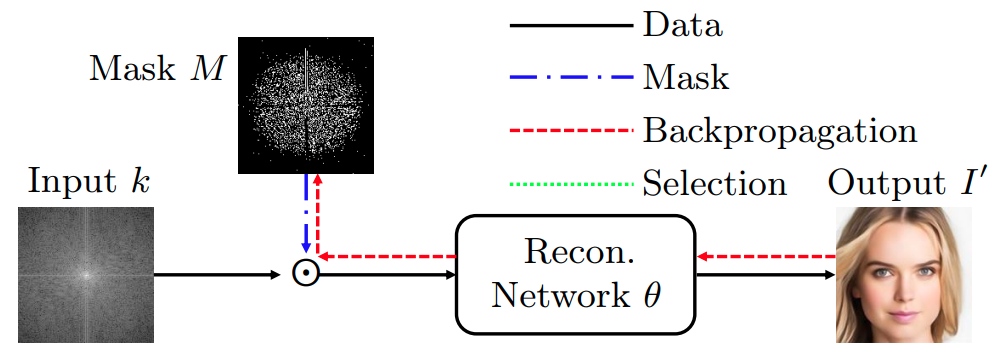
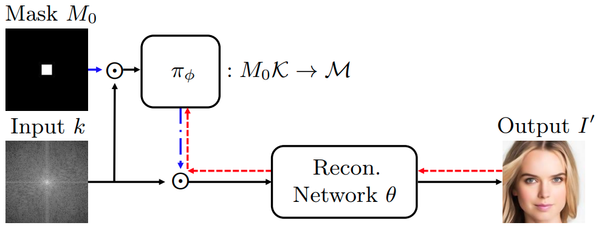
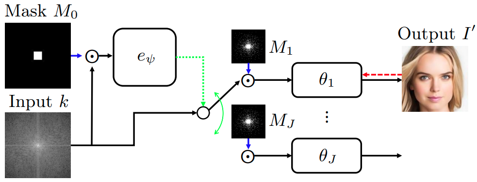
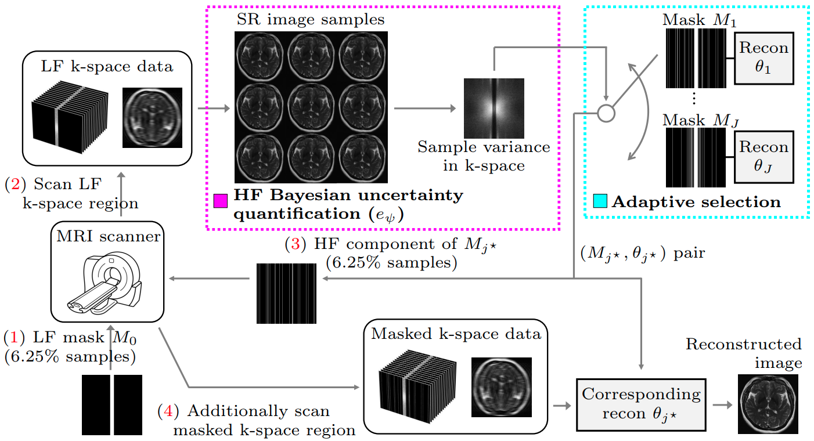
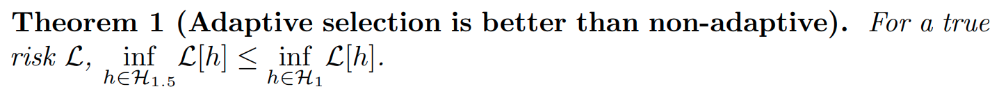
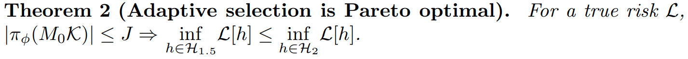
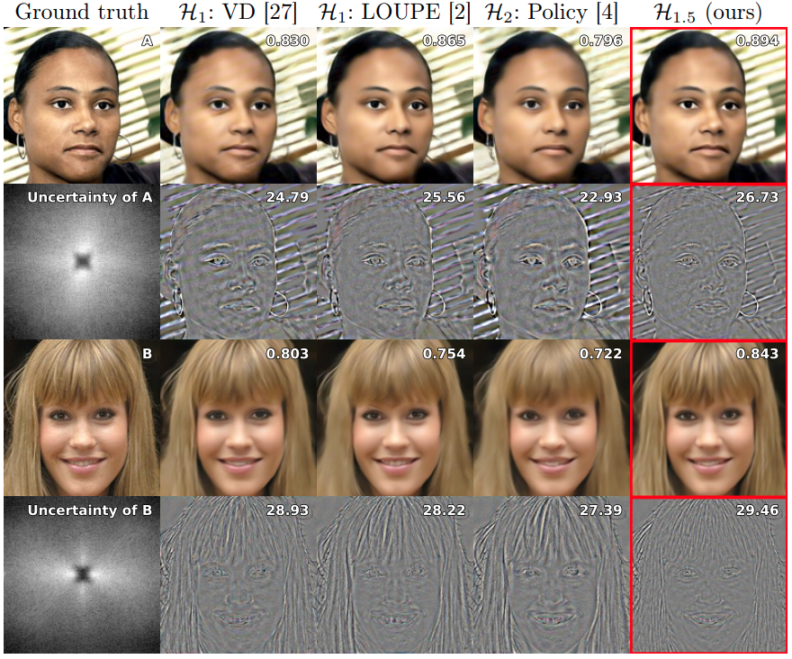
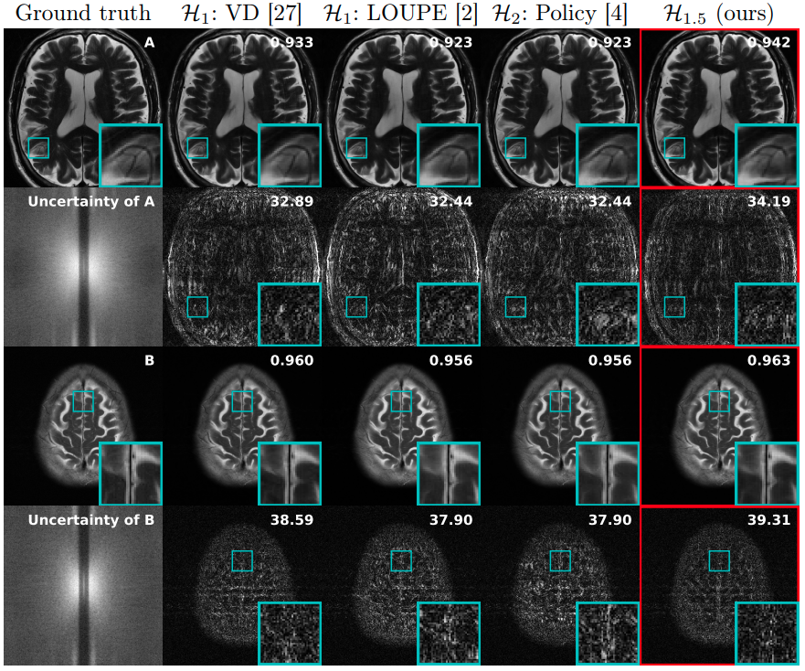

---
# Feel free to add content and custom Front Matter to this file.
# To modify the layout, see https://jekyllrb.com/docs/themes/#overriding-theme-defaults

layout: default
permalink: /ada-sel.html
---

<head>
    <meta charset="UTF-8">
    <meta name="viewport" content="width=device-width, initial-scale=1.0">
    <title>HTML Table Example</title>
    
</head>

## 
  Adaptive Selection of Sampling-Reconstruction in Fourier Compressed Sensing

#### 
 <a href="">Seongmin Hong</a>1, <a href="https://jaehyeokbae.me/">Jaehyeok Bae</a>1, <a href="https://list.snu.ac.kr/jongho-lee">Jongho Lee</a>1,2,*, <a href="https://icl.snu.ac.kr/pi">Se Young Chun</a>1,2,3,*

1Dept. of Electrical and Computer Engineering,   
 
2INMC, 3IPAI   
 
Seoul National University, Republic of Korea

### 
 <strong>Accepted to ECCV 2024</strong> 

#### 
 [[arXiv](https://arxiv.org/abs/2409.11738)] [<a href="https://github.com/smhongok/Non-uniform-B-spline-Flow">github</a>] [<a href="#bibtex">bibTeX</a>] 

     

## Goal

*Let’s find the best sampling mask for each input adaptive in Fourier compressed sensing!*

 

## Prior work vs Ours

There are two types of prior works.  

  

**Joint optimization of sampling-reconstruction** (H1) is non-adaptive to each input. 

  

**Adaptive sampling** (H2) is hard to train. 

   

But here is the thing:

 

  

Our **Adaptive selection of Sampling-Reconstruction** (H1.5) is fantastic!

     

In detail, ours have these advantages over prior works.

<table style="width: 70%; border: 1px solid black; border-collapse: collapse;">
    <tr>
        <th style="width: 25%; font-size:0.9em;"> </th>
        <th style="width: 25%; font-size:0.9em;">Adaptive to input k</th>
        <th style="width: 25%; font-size:0.9em;">Backprop to a continuous space</th>
        <th style="width: 25%; font-size:0.9em;">Parato optimal θ</th>
    </tr>
    <tr>
        <td style="font-size:0.9em;">Joint optimization  (H1)</td>
        <td>✗</td>
        <td>✗</td>
        <td>✔</td>
    </tr>
    <tr>
        <td style="font-size:0.9em;">Adaptive sampling  (H2)</td>
        <td>✔</td>
        <td>✗</td>
        <td>✗</td>
    </tr>
    <tr>
        <td style="font-size:0.9em;"><strong>Adaptive Selection  (H1.5)</strong></td>
        <td>✔</td>
        <td>✔</td>
        <td>✔</td>
    </tr>
</table>

     

## Method

 

  

Our method does: 

1. Acquire Low-frequency region first
2. Using SR space generation model, quantify the HF Bayesian uncertainty
3. Based on the HF Bayesian uncertainty, select the pair of sampling-reconstruction

     

## Theory

Why is our model better than prior works? We can prove it:

 

  

 

  

     

## Results

 

  

Ours showed the best SSIM and PSNR in face RGB reconstruction,

 

  

and in compressed sensing MRI (8x)!

     

## Abstract

Compressed sensing (CS) has emerged to overcome the inefficiency of Nyquist sampling. However, traditional optimization-based reconstruction is slow and can not yield an exact image in practice. Deep learning-based reconstruction has been a promising alternative to optimization-based reconstruction, outperforming it in accuracy and computation speed. Finding an efficient sampling method with deep learning-based reconstruction, especially for Fourier CS remains a challenge. Existing joint optimization of sampling-reconstruction works (H1) optimize the sampling mask but have low potential as it is not adaptive to each data point. Adaptive sampling (H2) has also disadvantages of difficult optimization and Pareto sub-optimality. Here, we propose a novel adaptive selection of sampling-reconstruction (H1.5) framework that selects the best sampling mask and reconstruction network for each input data. We provide theorems that our method has a higher potential than H1 and effectively solves the Pareto sub-optimality problem in sampling-reconstruction by using separate reconstruction networks for different sampling masks. To select the best sampling mask, we propose to quantify the high-frequency Bayesian uncertainty of the input, using a super-resolution space generation model. Our method outperforms joint optimization of sampling-reconstruction (H1) and adaptive sampling (H2) by achieving significant improvements on several Fourier CS problems.

  

<a name="bibtex">

## BibTeX

<pre> 
@InProceedings{Hong_2024_ECCV,
    author    = {Hong, Seongmin and Bae, Jaehyeok and Lee, Jongho and Chun, Se Young},
    title     = {Adaptive Selection of Sampling-Reconstruction in Fourier Compressed Sensing},
    booktitle = {European Conference on Computer Vision},
    month     = {October},
    year      = {2024},
}
</pre>
