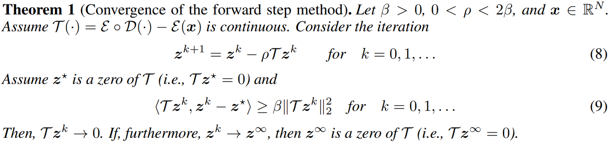

---
# Feel free to add content and custom Front Matter to this file.
# To modify the layout, see https://jekyllrb.com/docs/themes/#overriding-theme-defaults

layout: default
permalink: /dec-inv.html

---

## 
Gradient-free Decoder Inversion in Latent Diffusion Models

#### 
 <a href="">Seongmin Hong</a>1, <a href="https://www.linkedin.com/in/suhyoonjeon">Suh Yoon Jeon</a>1, <a href="https://www.linkedin.com/in/khlee0192">Kyeonghyun Lee</a>1, <a href="https://ernestryu.com/">Ernest K. Ryu</a>2, <a href="https://icl.snu.ac.kr/pi">Se Young Chun</a>1,3

1Dept. of Electrical and Computer Engineering, 3INMC & IPAI, Seoul National University     
 
2Dept. of Mathematics, University of California, Los Angeles   
 

### 
<strong>NeurIPS 2024</strong> 

#### 
[<a href="https://proceedings.neurips.cc/paper_files/paper/2024/hash/970f59b22f4c72aec75174aae63c7459-Abstract-Conference.html">Paper</a>] [<a href="http://arxiv.org/abs/2409.18442">arXiv</a>] [<a href="https://recorder-v3.slideslive.com/#/share?share=94209&s=10070c25-7055-403c-bd99-5bfc52ab749d">video</a>] [<a href="https://github.com/smhongok/dec-inv">github</a>] [<a href="#bibtex">bibTeX</a>]

 

 

 

## 
Main Idea (gif)

    

     

## 
Main Contribution

    

     

## 
 Convergence Analysis 

 

    <figure>
        
    </figure>

Our method provably converges.

 

 

 

    <figure>
        
    </figure>

Moreover, with momentum (inertial KM iteration),

 

 

    <figure>
        
    </figure>

It also provably converges.

 

 

 

## 
 Results 

 

    <figure>
        
    </figure>

Our gradient-free decoder inversion is:

- **Fast**: up to 5× faster, 1.89 s vs 9.51 s to achieve -16.4 dB (InstaFlow) 

- **Accurate**: up to 2.3 dB lower, -21.37 dB vs -19.06 dB in 25.1 s (LaVie) 

- **Memory-efficient**: up to *89%* can be saved, 7.13 GB vs 64.7 GB (Lavie) 

- **Precision-flexible**: 16-bit vs 32-bit (all)

 

 

 

 

## 
Poster

    <figure>
        
        <figcaption>Click the image to download the poster</figcaption>
    </figure>

 

 

 

 

## 
Abstract

In latent diffusion models (LDMs), denoising diffusion process efficiently takes place on latent space whose dimension is lower than that of pixel space. Decoder is typically used to transform the representation in latent space to that in pixel space. While a decoder is assumed to have an encoder as an accurate inverse, exact encoder-decoder pair rarely exists in practice even though applications often require precise inversion of decoder. Prior works for decoder inversion in LDMs employed gradient descent inspired by inversions of generative adversarial networks. However, gradient-based methods require larger GPU memory and longer computation time for larger latent space. For example, recent video LDMs can generate more than 16 frames, but GPUs with 24 GB memory can only perform gradient-based decoder inversion for 4 frames. Here, we propose an efficient gradient-free decoder inversion for LDMs, which can be applied to diverse latent models. Theoretical convergence property of our proposed inversion has been investigated not only for the forward step method, but also for the inertial Krasnoselskii-Mann (KM) iterations under mild assumption on cocoercivity that is satisfied by recent LDMs. Our proposed gradient-free method with Adam optimizer and learning rate scheduling significantly reduced computation time and memory usage over prior gradient-based methods and enabled efficient computation in applications such as noise-space watermarking while achieving comparable error levels.

  

   

<a name="bibtex">

## 
BibTeX

<pre> 
@misc{hong2024gradient,
      title={Gradient-free Decoder Inversion in Latent Diffusion Models}, 
      author={Seongmin Hong and Suh Yoon Jeon and Kyeonghyun Lee and Ernest K. Ryu and Se Young Chun},
      year={2024},
      eprint={2409.18442},
      archivePrefix={arXiv},
      primaryClass={cs.LG},
      url={https://arxiv.org/abs/2409.18442}, 
}
</pre>
